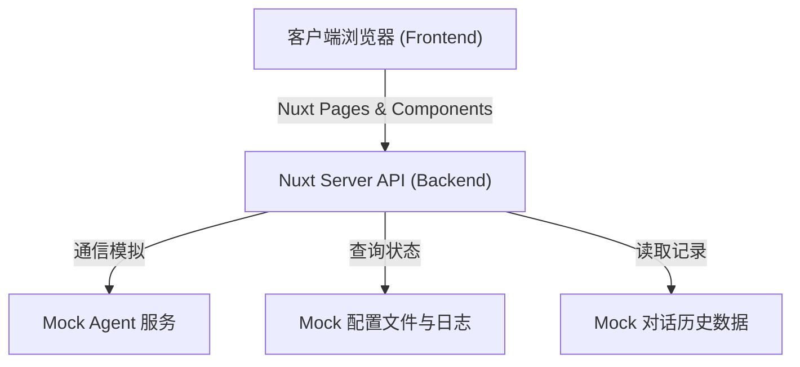
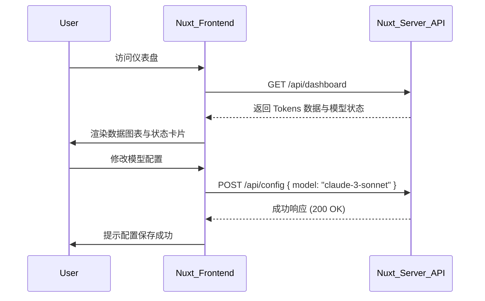
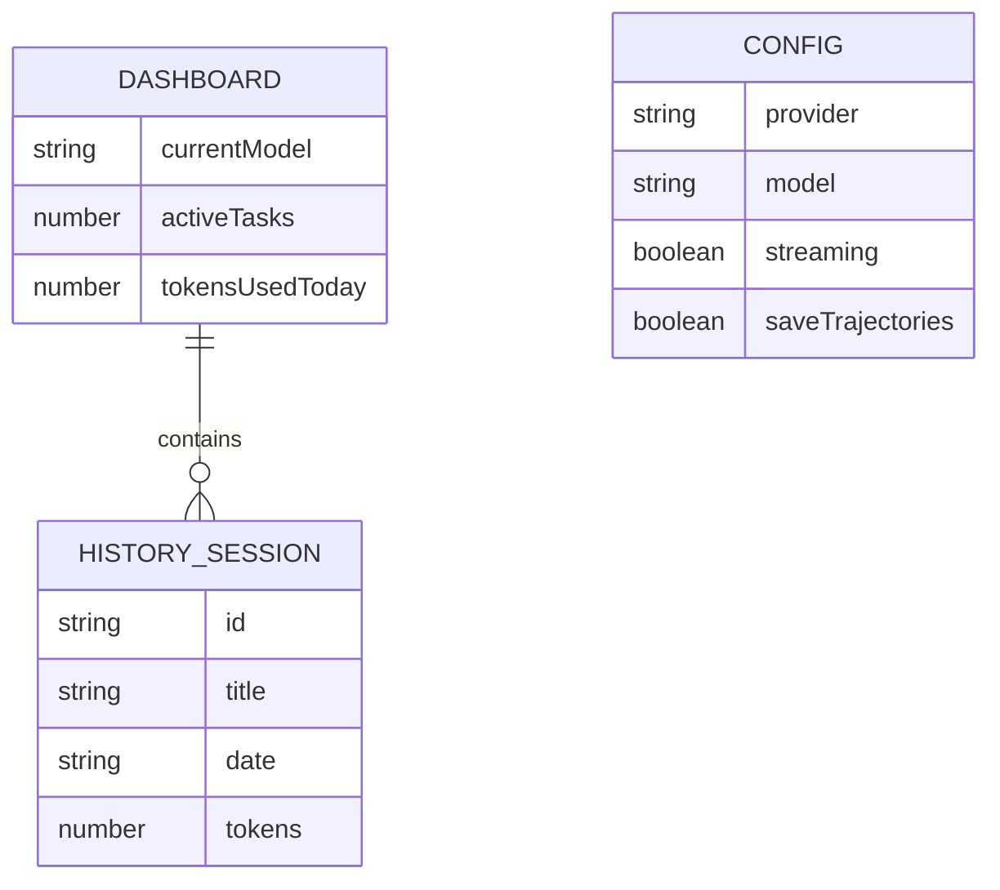

# 技术架构设计 (Technical Architecture) - Hermes Agent 可视化控制台

## 1. 架构设计
前端基于最新的 Nuxt.js 4 构建全栈能力。后端采用 Mock API（基于 Nuxt 的 server 目录或前端假数据）模拟与 Hermes Agent 的交互。

## 2. 技术说明
- **框架选型**：Nuxt 4 (`nuxt@latest`) + Vue 3
- **样式引擎**：Tailwind CSS v3 (`@nuxtjs/tailwindcss`)
- **图标与组件**：Lucide Vue (矢量图标)，Headless UI 或自研的极简组件库
- **图表库**：Chart.js (`vue-chartjs`) 或 ECharts 用于 Tokens 和运行状态可视化
- **代码高亮/Markdown**：用于渲染 Agent 对话记录和日志内容
- **Mock 服务**：在 `server/api` 目录编写本地路由响应 JSON 数据

## 3. 路由定义
| 路由 | 页面说明 |
|-------|---------|
| `/` | 仪表盘 (Dashboard)，展示核心指标概览 |
| `/config` | 配置中心 (Configuration)，切换模型、调整网关、Tools |
| `/history` | 历史记录 (History)，查看过往任务及对话详情 |
| `/logs` | 系统日志与任务 (Logs & Tasks)，查看终端输出 |

## 4. API 定义 (Mock 服务)
为模拟 Hermes Agent，定义以下核心接口：
- `GET /api/dashboard`：获取实时系统状态 (CPU/内存)、活跃模型、今日 Tokens 消耗。
- `GET /api/config`：获取当前配置项（Providers, Tools, Webhooks）。
- `POST /api/config`：更新 Agent 配置参数。
- `GET /api/history`：获取对话会话列表。
- `GET /api/history/:id`：获取单次会话详细记录。
- `GET /api/logs`：获取系统运行日志。

## 5. 服务架构图 (Mock)

## 6. 数据模型 (Mock 结构)
### 6.1 数据实体关系

