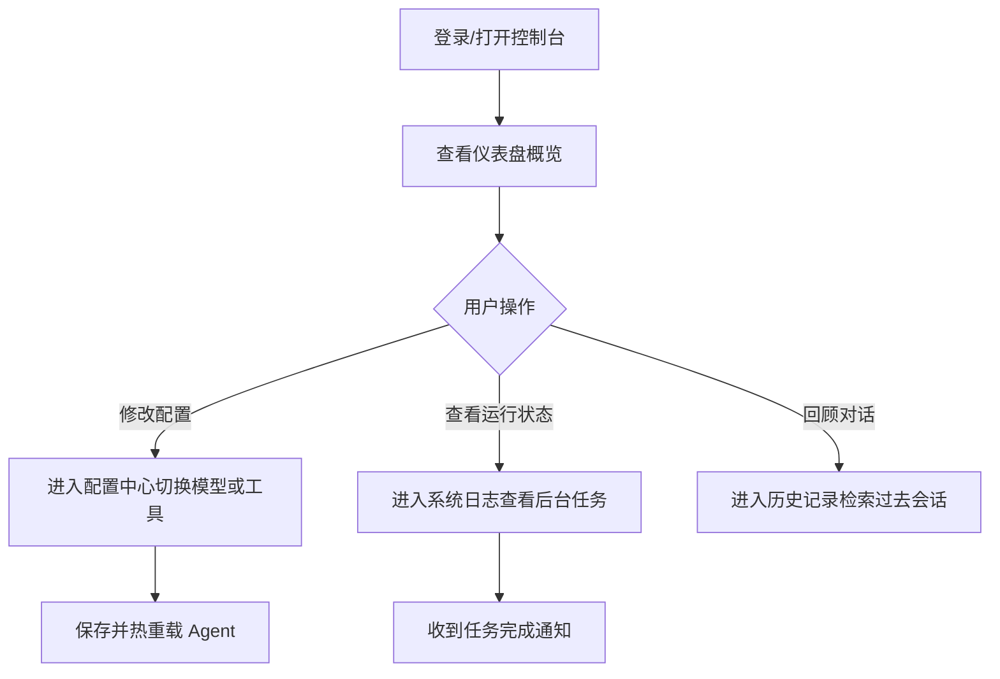

# 产品需求文档 (PRD) - Hermes Agent 可视化控制台

## 1. 产品概述
构建一个专为 Hermes Agent 打造的现代化、高颜值的可视化控制台 Web 应用。
- **主要目的**：为原本基于 CLI 和消息网关的 Hermes Agent 提供一个直观的图形化界面，降低管理和配置门槛。
- **目标用户**：使用 Hermes Agent 的开发者、研究人员及高级用户。
- **核心价值**：提供开箱即用的配置管理、实时状态监控、对话历史回溯及 Tokens 消耗统计，打造极致的 Agent 管理体验。

## 2. 核心功能

### 2.1 功能模块
1. **仪表盘 (Dashboard)**：展示 Agent 整体运行状态、当前激活的模型、活跃子 Agent 数量以及核心 Tokens 消耗数据。
2. **配置管理 (Configuration)**：可视化修改 `hermes config` 相关参数，包括模型选择、网关平台开关、工具集(Tools)启用状态等。
3. **对话历史 (History)**：支持跨会话的对话历史查看，利用其内置记忆系统展示过去处理的任务和技能(Skills)学习记录。
4. **系统状态与日志 (Status & Logs)**：展示后台任务通知、MCP 服务器状态以及实时的终端/网关日志流。

### 2.2 页面细节
| 页面名称 | 模块名称 | 功能描述 |
|-----------|-------------|---------------------|
| **仪表盘** | 数据概览 | 实时显示 CPU/内存使用率、模型提供商(Provider)、累计 Tokens 消耗折线图。 |
| | 活跃任务 | 展示正在执行的 Cron 定时任务及后台异步任务的进度。 |
| **配置中心** | 模型设置 | 允许用户在页面上热切换模型 (Live Model Switching)。 |
| | 工具配置 | 开启/关闭特定的 Tools，管理系统预设。 |
| **对话历史** | 会话列表 | 按时间轴展示最近的对话任务，支持按平台（Telegram, CLI 等）过滤。 |
| | 会话详情 | 展示用户输入、Agent 思考过程（工具调用）及最终回复，支持 Markdown 渲染。 |
| **系统日志** | 实时终端 | 模拟终端界面输出系统运行日志，支持自动滚动和关键字高亮。 |

## 3. 核心流程
用户通过控制台管理 Hermes Agent 的主要流程：

## 4. 用户界面设计

### 4.1 设计风格
- **整体基调**：极客风与现代科技感结合 (Tech & Cyber-minimalism)。采用暗黑模式 (Dark Mode) 为主，以体现命令行工具的极客本质。
- **主次颜色**：深邃的终端黑 (`#09090b`) 作为背景，搭配荧光绿 (`#10b981`) 或赛博蓝 (`#3b82f6`) 作为强调色（Accent Color）。
- **字体选择**：
  - 标题和正文：`Inter` 或 `Space Grotesk`，体现现代感。
  - 代码与终端区域：`JetBrains Mono` 或 `Fira Code` 等等宽字体。
- **组件风格**：卡片式布局，微透视的毛玻璃效果 (Glassmorphism) 作为导航栏和侧边栏材质，按钮带有轻微的发光或边框渐变效果。
- **动画效果**：数据的渐显加载，数字滚动动画，日志区域平滑滚动，保持极致的流畅感。

### 4.2 页面设计概览
| 页面名称 | 模块名称 | UI 元素 |
|-----------|-------------|-------------|
| **全局布局** | 侧边导航栏 | 包含仪表盘、配置、历史、日志等菜单项，高亮当前所在页面。 |
| **仪表盘** | 状态卡片 | 包含发光图标、大号数据字体、迷你趋势图（Sparkline）。 |
| **配置中心** | 表单控件 | 使用精致的 Toggle Switch 切换开关，带有搜索功能的 Select 下拉框选择模型。 |
| **系统日志** | 终端模拟器 | 黑底绿/白字，支持彩色输出的终端样式块。 |

### 4.3 响应式设计
- **桌面端优先 (Desktop-first)**：最大化利用屏幕空间，提供丰富的多栏布局和数据展示。
- **移动端适配 (Mobile-adaptive)**：侧边栏折叠为底部导航栏或汉堡菜单，数据卡片自适应堆叠为单列。
